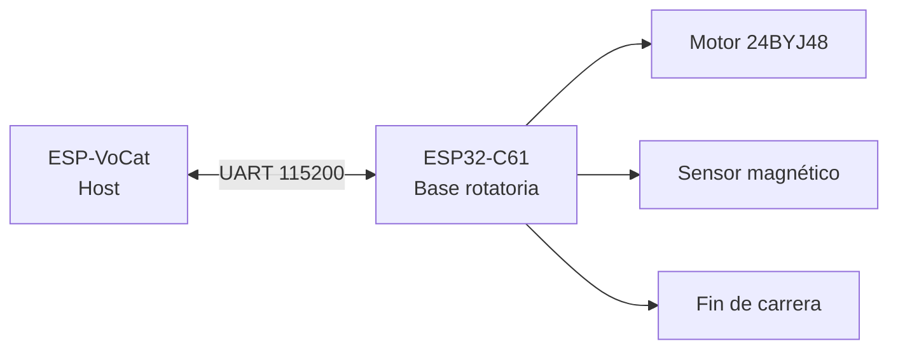

# Base rotatoria inteligente ESP-VoCat

**Documentación técnica en español**

[Español](README_ES.md) | [English](README.md)

---

## Guía central del proyecto

Este repositorio contiene el **firmware, hardware y documentación** de la base rotatoria ESP-VoCat de Espressif: una plataforma giratoria con motor paso a paso, detección magnética y comunicación UART para el kit [ESP-VoCat](https://docs.espressif.com/projects/esp-dev-kits/zh_CN/latest/esp32s3/esp-vocat/user_guide_v1.2.html).

| Documento | Contenido |
|-----------|-----------|
| **[Arquitectura del sistema](docs/es/arquitectura.md)** | Diagramas Mermaid, capas HW/FW, UART, calibración, máquina de estados |
| **[Hardware (Main/Sub Board)](docs/es/hardware.md)** | Esquemáticos, alimentación, GPIO, motor, sensores |
| **[BOM — lista de materiales](docs/es/BOM.md)** | Designadores, valores, MPN, alternativas, cantidades |
| **[Lista de compra](docs/es/lista-compra.md)** | Compra por categorías; Espressif vs equivalentes |
| **[Guía de ensamblaje](docs/es/guia-ensamblaje.md)** | Impresión 3D, montaje paso a paso, calibración inicial |
| **[Auditoría hardware](docs/es/auditoria-hardware.md)** | MPN faltantes, contradicciones, checklist, % reproducibilidad |
| **[Auditoría documentación](docs/es/auditoria-documentacion.md)** | Archivos chinos, plan de limpieza, autosuficiencia ES |
| **[Tablas de referencia](docs/es/tablas-referencia.md)** | GPIO, hardware, sensores, acciones, comandos UART, eventos, proyectos |
| **[Arranque del firmware](docs/es/arranque-firmware.md)** | Secuencia de inicialización paso a paso + diagramas de secuencia |
| **[Arquitectura de perfiles](docs/es/perfiles.md)** | Cómo los 4 proyectos reutilizan componentes con `MAG_SW_PROFILE` |
| **[Extender el proyecto](docs/es/extender-proyecto.md)** | Nuevo perfil, sensor, acción de motor, buenas prácticas |
| **[Troubleshooting](docs/es/troubleshooting.md)** | Resolución de problemas frecuentes |
| **[Sensado magnético](magnetic_sensing_interaction_solution_es.md)** | Eventos por proyecto de demostración |

### Firmware por proyecto

| Proyecto | Documentación | Perfil |
|----------|---------------|--------|
| [esp_vocat_rotating_base](software/esp_vocat_rotating_base/README_ES.md) | Firmware base estándar | `base` |
| [bell_event_detection](software/esp_vocat_rotating_base_bell_event_detection/README_ES.md) | Deslizador tipo campana | `bell` |
| [iphone_detection](software/esp_vocat_rotating_base_iphone_detection/README_ES.md) | Detección de iPhone | `iphone` |
| [magnetic_accessory_detection](software/esp_vocat_rotating_base_magnetic_accessory_detection/README_ES.md) | Accesorios (pez, helado, dona) | `magnetic_accessory` |

---

## Descripción general

La base rotatoria utiliza el módulo **ESP32-C61-WROOM-1(N8R2)** y se comunica con la unidad principal ESP-VoCat mediante un **protocolo UART personalizado** a 115200 bps. Incorpora un motor **24BYJ48** con driver ULN2003 para rotación silenciosa orientada a la fuente sonora, y un **interruptor deslizante magnético** con magnetómetro BMM150 (por defecto) para interacción física.



### Capacidades principales

- **Control angular preciso** — Rotación con aceleración/desaceleración; precisión documentada ±0,5°
- **Acciones predefinidas** — Sacudir cabeza, mirar alrededor, seguir ritmo, acariciar
- **Homing automático** — Búsqueda de fin de carrera al arrancar + centrado a 95°
- **Detección magnética** — Hasta 11 tipos de eventos (perfil `base`); perfiles especializados para campana, iPhone y accesorios
- **Calibración automática** — 3 posiciones, persistencia en NVS Flash
- **Comunicación bidireccional** — Comandos de ángulo/acción entrantes; eventos y estado salientes

---

## Inicio rápido

### Requisitos

| Componente | Versión |
|------------|---------|
| ESP-IDF | ≥ 5.5.0 |
| Target | `esp32c61` |
| Python | 3.8+ (incluido con ESP-IDF) |

### Compilar y flashear

```bash
cd software/esp_vocat_rotating_base
idf.py set-target esp32c61
idf.py menuconfig    # Component config → Magnetic Slide Switch → Sensor Type
idf.py build
idf.py -p COM_PORT flash monitor
```

> Sustituya `COM_PORT` por su puerto serie (p. ej. `COM3` en Windows, `/dev/ttyUSB0` en Linux).

Para otros demos, cambie al directorio correspondiente bajo `software/` (ver [tabla de proyectos](docs/es/tablas-referencia.md#proyectos-de-ejemplo--comparativa)).

---

## Estructura del repositorio

```
pet-voice-AI/
├── docs/es/                         # Documentación técnica en español
│   ├── arquitectura.md
│   ├── hardware.md
│   ├── BOM.md
│   ├── lista-compra.md
│   ├── guia-ensamblaje.md
│   ├── tablas-referencia.md
│   ├── arranque-firmware.md
│   ├── perfiles.md
│   ├── extender-proyecto.md
│   └── troubleshooting.md
├── hardware/                        # Esquemáticos y PCB (PDF)
├── 3D_models/                       # Piezas mecánicas (.stp / .STEP)
├── software/
│   ├── common_components/           # Componentes compartidos
│   │   ├── stepper_motor/
│   │   ├── control_serial/
│   │   ├── magnetic_slide_switch/   # Perfiles: base, bell, iphone, magnetic_accessory
│   │   └── BMM150_SensorAPI/
│   └── esp_vocat_rotating_base*/    # 4 aplicaciones compilables
├── magnetic_sensing_interaction_solution_es.md
├── README_ES.md                     # ← Guía central (español)
└── README.md                        # English documentation
└── CHANGELOG.md
```

---

## Resumen de arquitectura

### Capas del sistema

| Capa | Contenido | Ubicación |
|------|-----------|-----------|
| **Aplicación** | `app_main`, homing, callbacks | `software/esp_vocat_rotating_base*/main/` |
| **Componentes** | Motor, UART, detección magnética | `software/common_components/` |
| **Drivers** | BMM150 API, I2C bus | `BMM150_SensorAPI/`, ESP-IDF |
| **HAL implícita** | GPIO, UART, ADC, I2C encapsulados en cada componente | ESP-IDF `driver/` |
| **Hardware** | PCB, motor, sensores, mecánica | `hardware/`, `3D_models/` |

Detalle completo con diagramas: **[Arquitectura del sistema](docs/es/arquitectura.md)**

### Arquitectura de perfiles

Los cuatro proyectos de firmware comparten `stepper_motor`, `control_serial` y `BMM150_SensorAPI`. Solo cambia el perfil de `magnetic_slide_switch`, seleccionado en CMake:

```cmake
set(MAG_SW_PROFILE "base")   # base | bell | iphone | magnetic_accessory
```

Explicación detallada: **[Arquitectura de perfiles](docs/es/perfiles.md)**

---

## Referencia rápida de hardware

| Recurso | Enlace |
|---------|--------|
| PCB y esquemáticos | Carpeta [`hardware/`](hardware/) |
| Modelos 3D | Carpeta [`3D_models/`](3D_models/) |
| Base magnética (open source) | [OSHWHUB — esp-echoear-base](https://oshwhub.com/esp-college/esp-echoear-base) |
| ESP-VoCat (open source) | [OSHWHUB — echoear](https://oshwhub.com/esp-college/echoear) |

Tabla completa de GPIO y componentes: **[Tablas de referencia → GPIO](docs/es/tablas-referencia.md#asignación-de-gpio)**

---

## Comunicación UART (resumen)

**Formato:** `AA 55 [LEN_H] [LEN_L] [CMD] [DATA...] [CHECKSUM]`

| Dirección | CMD | Función |
|-----------|-----|---------|
| Host → Base | `0x01` | Control de ángulo (0–180°) |
| Host → Base | `0x02` | Acción del motor |
| Host → Base | `0x03` | Recalibración magnética (`0x0010`) |
| Base → Host | `0x00` | Estado de acoplamiento magnético |
| Base → Host | `0x02` | Acción completada (`0x0010`) |
| Base → Host | `0x03` | Evento magnético / paso de calibración |

Tablas completas con ejemplos hex: **[Tablas de referencia → UART](docs/es/tablas-referencia.md#comandos-uart)**

---

## Demostración de funcionalidades

[**Video de demostración (Bilibili)**](https://www.bilibili.com/video/BV19gSEBwEoj/?spm_id_from=333.1365.list.card_archive.click&vd_source=e731e982043e3ccbb2c03395e0a66c39)

### Localización de fuente sonora

ESP-VoCat detecta la dirección del sonido mediante arreglo de micrófonos. La base recibe el ángulo por UART (`CMD 0x01`) y rota hacia la fuente.


### Acciones predefinidas

| Acción | Descripción |
|--------|-------------|
| Sacudir la cabeza | Balanceo suave izquierda-derecha |
| Mirar alrededor | Movimiento con pausas y offset aleatorio |
| Seguir el ritmo | Balanceo sincronizado con música |
| Acariciar | Giro lento a la izquierda y retorno al centro |


Todas las acciones son **parametrizables** para integración con modelos de lenguaje (Doubao, Xiaozhi, etc.).

### Interruptor magnético


Sensores compatibles: **BMM150** (defecto), **QMC6309**, **Hall lineal** (solo deslizamiento arriba/abajo).

> **Proyecto complementario en el host:** [Demostración UI del deslizador magnético (Gitee)](https://gitee.com/esp-friends/esp-echo-ear-xiaozhi/tree/feat%2Fadd_mag_slide_switch_demo/)

### Sensado CSI (host ESP-VoCat)

Capacidad del host, no de la base. Los comandos CSI en UART están planificados para versiones futuras (ver nota en documentación original).


---

## Arranque del firmware (resumen)

| Paso | Acción |
|------|--------|
| 1 | `nvs_flash_init()` — persistencia de calibración |
| 2 | `stepper_motor_gpio_init()` — GPIO 25–28 |
| 3 | Inicializar fin de carrera (GPIO 1) y Boot (GPIO 9) |
| 4 | `control_serial_init()` — UART1 @ 115200 |
| 5 | `base_calibration_task` — homing paralelo (fin de carrera → +95°) |
| 6 | `magnetic_slide_switch_start()` — I2C, calibración magnética, detección |

Secuencia detallada con diagramas: **[Arranque del firmware](docs/es/arranque-firmware.md)**

---

## Resolución de problemas

| Problema | Ver |
|----------|-----|
| Motor no encuentra Home | [Troubleshooting §1](docs/es/troubleshooting.md#1-el-motor-no-encuentra-el-home) |
| Sensor no calibra | [Troubleshooting §2](docs/es/troubleshooting.md#2-el-sensor-no-calibra) |
| Error UART | [Troubleshooting §3](docs/es/troubleshooting.md#3-error-de-comunicación-uart) |
| Sensor mal configurado | [Troubleshooting §4](docs/es/troubleshooting.md#4-configuración-incorrecta-del-sensor) |
| Error de compilación | [Troubleshooting §5](docs/es/troubleshooting.md#5-problemas-al-compilar-con-esp-idf) |

---

## Historial de versiones

Ver [CHANGELOG.md](CHANGELOG.md). Versión actual de los proyectos de firmware: **V1.0.4** (definida en `CMakeLists.txt` de cada aplicación).

---

## Licencia

- Código de componentes Espressif: **Apache-2.0** (cabeceras SPDX en fuentes).
- Firmware de aplicación: **GPL-3.0** (según README del proyecto base).

---

## Contribuir y extender

- **Nuevo perfil magnético:** [Extender el proyecto → Crear perfil](docs/es/extender-proyecto.md#1-crear-un-nuevo-perfil-magnético)
- **Nueva acción de motor:** [Extender el proyecto → Acciones](docs/es/extender-proyecto.md#3-agregar-nuevas-acciones-del-motor)
- **Nuevo sensor:** [Extender el proyecto → Sensores](docs/es/extender-proyecto.md#2-agregar-un-nuevo-sensor-magnético)

---

*Documentación generada a partir del código fuente, comentarios del firmware y documentación oficial del repositorio ESP-VoCat Base.*
