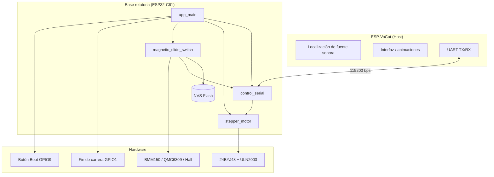
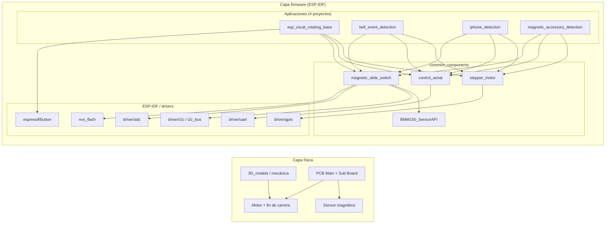
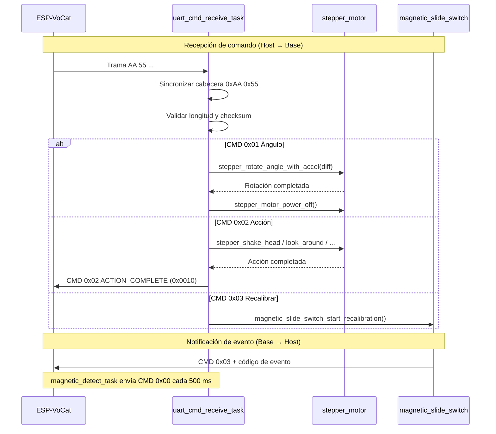
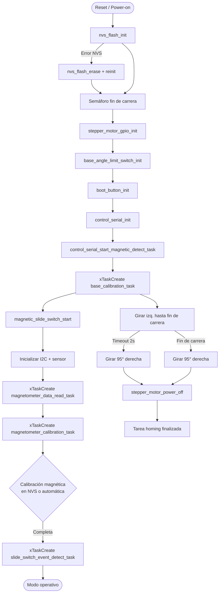
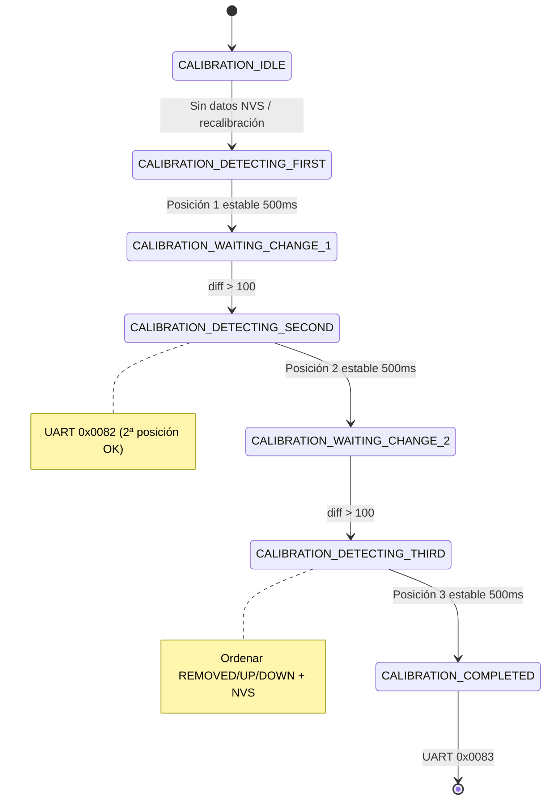
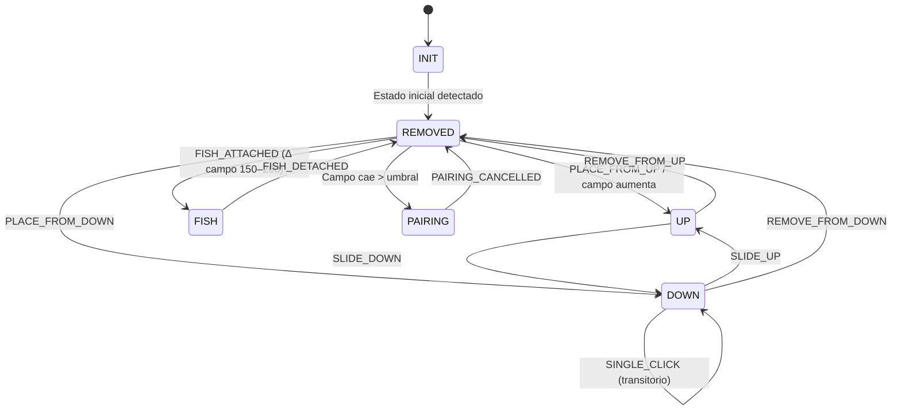
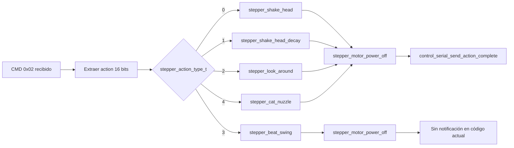
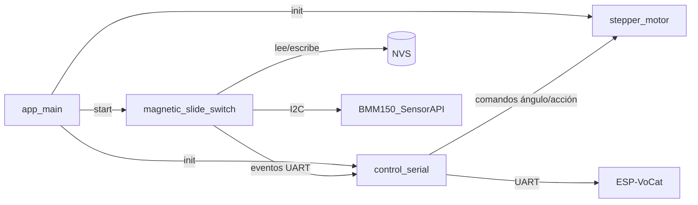

# Arquitectura del sistema

> Derivado de: `app_main`, `control_serial.c`, `stepper_motor.c`, `magnetic_slide_switch/`, `CMakeLists.txt` de cada proyecto.

[← Volver a la guía principal](../../README_ES.md) · [Tablas de referencia](tablas-referencia.md)

---

## 1. Arquitectura general



La base actúa como **periférico inteligente**: recibe comandos de ángulo y acción del host ESP-VoCat, ejecuta movimiento mecánico y reporta eventos del interruptor magnético de vuelta por UART.

---

## 2. Hardware, firmware y componentes compartidos



**Nota sobre capas HAL:** Este repositorio no define un directorio `hal/` explícito. La abstracción de hardware se implementa dentro de cada componente (`stepper_motor` encapsula GPIO; `magnetic_slide_switch` encapsula I2C/ADC; `control_serial` encapsula UART), apoyándose en los drivers oficiales de ESP-IDF.

---

## 3. Flujo de comunicación UART



**Reglas de parsing** (`control_serial.c`):
1. Búsqueda de cabecera `0xAA 0x55` en el buffer recibido.
2. Lectura de `LEN` y validación de trama completa.
3. Cálculo de checksum **antes** de ejecutar el comando.
4. Para ángulo: rango válido 0–180°; posición absoluta interna inicializada en 90°.

---

## 4. Flujo de inicialización del sistema



**Orden real en `app_main`** (líneas 154–181 de `esp_vocat_rotating_base_main.c`):

| Paso | Función | Descripción |
|------|---------|-------------|
| 1 | `nvs_flash_init()` | Persistencia para calibración magnética |
| 2 | `xSemaphoreCreateBinary()` | Sincronización fin de carrera ↔ homing |
| 3 | `stepper_motor_gpio_init()` | Configura GPIO 25–28 como salidas |
| 4 | `base_angle_limit_switch_init()` | GPIO 1 + callbacks `iot_button` |
| 5 | `boot_button_init()` | GPIO 9; pulsación larga → recalibración |
| 6 | `control_serial_init()` | UART1 @ 115200 + `uart_cmd_receive_task` |
| 7 | `control_serial_start_magnetic_detect_task()` | Reporte periódico de acoplamiento |
| 8 | `xTaskCreate(base_calibration_task)` | Homing mecánico (paralelo) |
| 9 | `magnetic_slide_switch_start()` | I2C, calibración magnética, detección |

> **I2C:** La inicialización del bus I2C y del sensor BMM150/QMC6309 ocurre dentro de `magnetic_slide_switch_start()` → `magnetometer_data_read_task`, no en `app_main`.

---

## 5. Flujo de calibración automática magnética



**Asignación automática** (tras la tercera posición):
- Valor magnético **menor** → `REMOVED`
- Valor **intermedio** → `UP`
- Valor **mayor** → `DOWN`

Constantes (`magnetic_slide_switch.h`, BMM150): `CALIBRATION_STABILITY_TIME_MS = 500`, `CALIBRATION_VALUE_DIFF_THRESHOLD = 100`.

---

## 6. Máquina de estados del interruptor magnético (perfil `base`)

Durante el modo operativo, `slide_switch_event_detect_task` evalúa el eje Z filtrado (ventana deslizante) contra los umbrales calibrados:



Cada transición confirmada dispara `control_serial_send_magnetic_switch_event()` en perfil `base`, o invoca callbacks registrados en perfiles `bell`, `iphone` y `magnetic_accessory`.

---

## 7. Flujo de ejecución de acciones del motor



Todas las funciones de acción utilizan **half-step** (8 pasos por ciclo) con curvas de aceleración/desaceleración (`STEPPER_ACCEL_STEPS = 30`, `STEPPER_DECEL_STEPS = 30`).

---

## 8. Arquitectura del código

```
software/
├── esp_vocat_rotating_base/              # Aplicación (perfil base)
│   └── main/
│       ├── esp_vocat_rotating_base_main.c   # app_main, homing, botones
│       ├── CMakeLists.txt
│       └── idf_component.yml
├── esp_vocat_rotating_base_*_*/          # Aplicaciones demo (otros perfiles)
│   └── main/                             # Igual estructura + callback UART
└── common_components/
    ├── stepper_motor/                    # Lógica de movimiento
    │   ├── stepper_motor.c
    │   └── include/stepper_motor.h
    ├── control_serial/                   # Protocolo UART
    │   ├── control_serial.c
    │   └── include/control_serial.h
    ├── magnetic_slide_switch/            # Detección magnética multi-perfil
    │   ├── CMakeLists.txt                # Selección MAG_SW_PROFILE
    │   ├── Kconfig                       # Tipo de sensor
    │   └── profiles/
    │       ├── base/
    │       ├── bell/
    │       ├── iphone/
    │       └── magnetic_accessory/
    └── BMM150_SensorAPI/                 # Driver Bosch BMM150
```

### Tareas FreeRTOS en ejecución (magnetómetro, perfil típico)

| Tarea | Prioridad | Origen | Función |
|-------|-----------|--------|---------|
| `uart_cmd_receive_task` | 12 | `control_serial_init` | Recibe y despacha comandos UART |
| `base_calibration_task` | 10 | `app_main` | Homing mecánico (se autodestruye) |
| `magnetic_detect_task` | 5 | `control_serial` | Reporte periódico acoplamiento |
| `mag_data_read_task` | 3 | `magnetic_slide_switch` | Lectura continua del sensor |
| `mag_calibration_task` | 3 | `magnetic_slide_switch` | Calibración automática |
| `slide_switch_detect_task` | 2 | `magnetic_slide_switch` | Detección de eventos |

### Comunicación entre módulos


