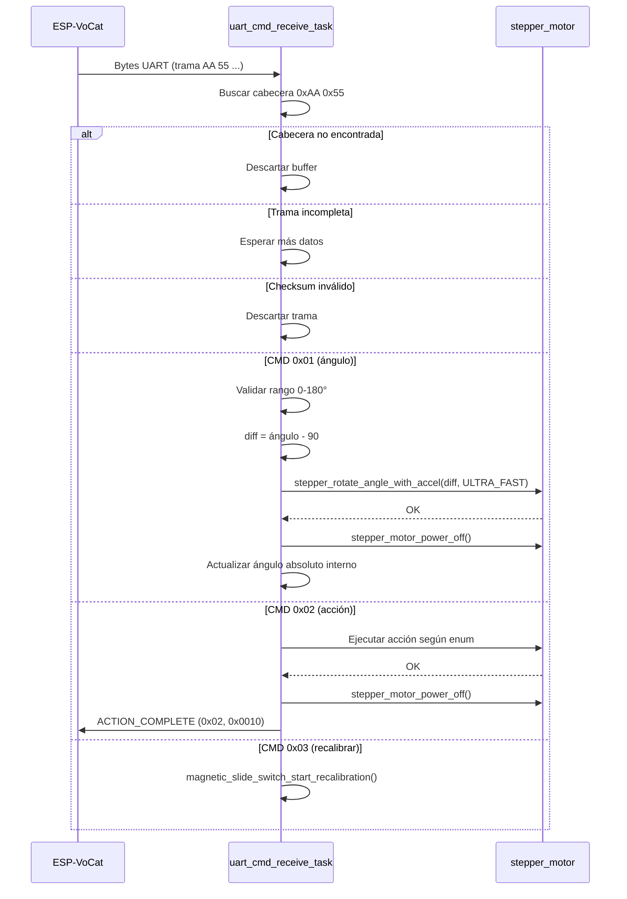
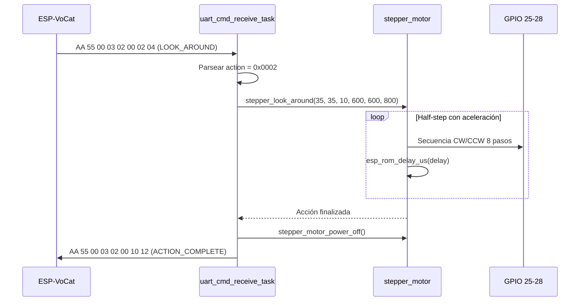
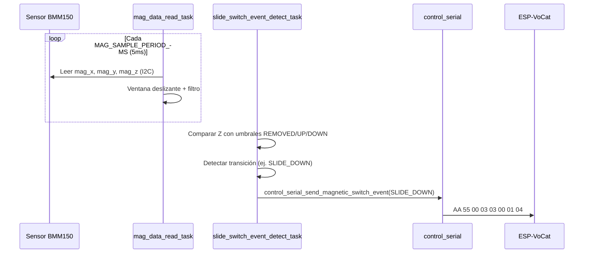
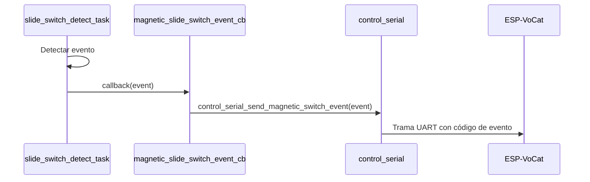
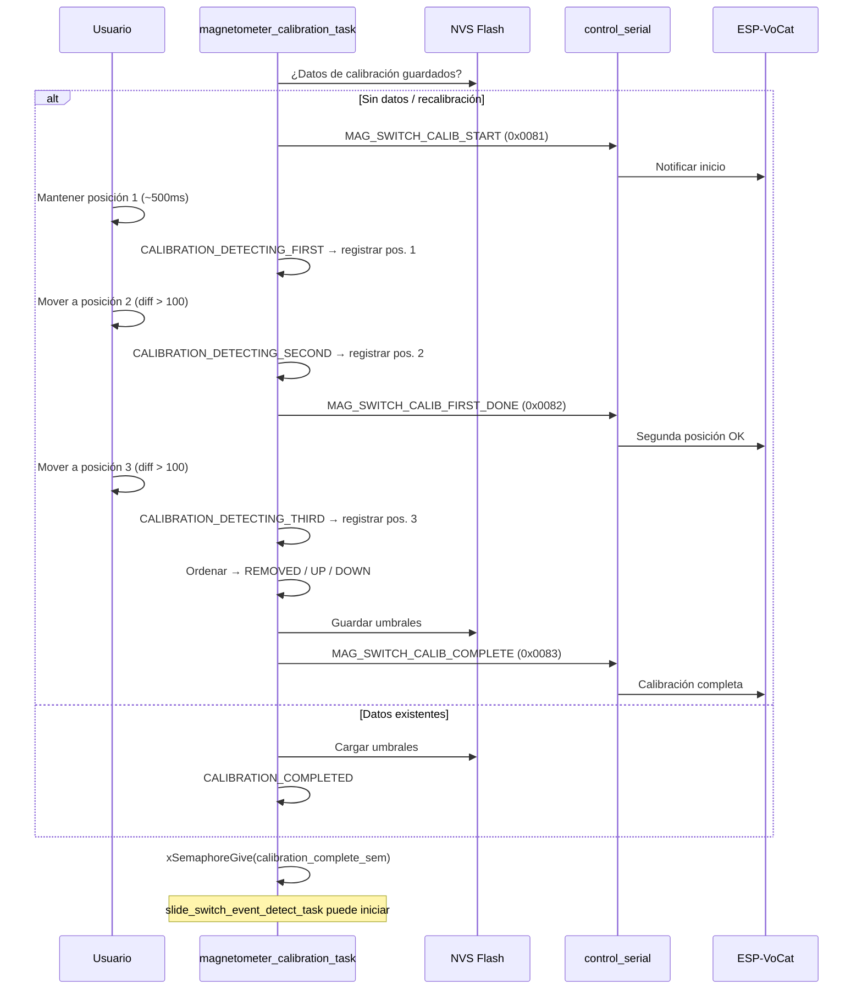

# Arranque del firmware y diagramas de secuencia

> Derivado de: `esp_vocat_rotating_base_main.c`, `control_serial.c`, `magnetic_slide_switch/profiles/base/magnetic_slide_switch.c`.

[← Volver a la guía principal](../../README_ES.md) · [Arquitectura](arquitectura.md)

---

## Proceso de arranque paso a paso

### Fase 1 — Inicialización de NVS

```c
esp_err_t ret = nvs_flash_init();
if (ret == ESP_ERR_NVS_NO_FREE_PAGES || ret == ESP_ERR_NVS_NEW_VERSION_FOUND) {
    nvs_flash_erase();
    ret = nvs_flash_init();
}
```

- **Propósito:** Almacenar datos de calibración magnética (posiciones REMOVED/UP/DOWN).
- **Recuperación:** Si la partición NVS está llena o la versión cambió, se borra y reinicializa.

### Fase 2 — Sincronización de homing

- Se crea un **semáforo binario** (`s_limit_switch_semaphore`).
- El callback del fin de carrera (GPIO 1) libera el semáforo desde ISR al detectar `BUTTON_PRESS_DOWN`.

### Fase 3 — Inicialización del motor

```c
stepper_motor_gpio_init();  // GPIO 25, 26, 27, 28 como salidas, nivel bajo inicial
```

### Fase 4 — Inicialización de botones

| Botón | GPIO | Evento | Acción |
|-------|------|--------|--------|
| Fin de carrera | 1 | `BUTTON_PRESS_DOWN` | Notifica a `base_calibration_task` |
| Boot | 9 | `BUTTON_LONG_PRESS_START` | `magnetic_slide_switch_start_recalibration()` |

### Fase 5 — Inicialización de UART

```c
control_serial_init();
// UART1, 115200 bps, 8N1, TX=GPIO29, RX=GPIO8
// Crea uart_cmd_receive_task (prioridad 12)
```

### Fase 6 — Tarea de detección de acoplamiento

```c
control_serial_start_magnetic_detect_task();
// Envía CMD 0x00 (ATTACHED) cada MAGNETIC_DETECT_INTERVAL_MS (500 ms)
```

> **Nota del código:** `magnetic_detect_task` actualmente reporta siempre `MAGNETIC_ATTACH_STATUS_ATTACHED`. Existe un `TODO` para implementar detección Hall real.

### Fase 7 — Homing mecánico (tarea paralela)

`base_calibration_task` (prioridad 10):

1. Inicializa el fin de carrera.
2. En bucle: gira **-5°** a la izquierda (`STEPPER_SPEED_FAST`) cada 2 ms.
3. Si el fin de carrera se activa → espera 200 ms → gira **+95°** → apaga motor → termina.
4. Si **timeout 2000 ms** → asume fallo mecánico → gira +95° directamente → apaga motor → termina.

### Fase 8 — Inicialización del sensor magnético

`magnetic_slide_switch_start()`:

1. **I2C** (dentro de `magnetometer_data_read_task`): SCL=GPIO3, SDA=GPIO2, 400 kHz.
2. **Inicialización del chip** BMM150 (`0x10`) o QMC6309 (`0x7C`) según `menuconfig`.
3. Crea `magnetometer_data_read_task` (lectura continua, ventana deslizante).
4. Crea `magnetometer_calibration_task`:
   - Si hay datos en NVS → carga umbrales → estado `CALIBRATION_COMPLETED`.
   - Si no → inicia máquina de estados de calibración automática (3 posiciones).
5. **Bloquea** hasta que la calibración termina (`xSemaphoreTake(s_calibration_complete_sem)`).
6. Crea `slide_switch_event_detect_task` (detección de eventos en modo operativo).

### Fase 9 — Modo operativo

Tras completar homing y calibración magnética:
- La base acepta comandos UART de ángulo y acción.
- El interruptor magnético detecta y reporta eventos.
- El motor permanece apagado (`stepper_motor_power_off`) hasta recibir un comando.

---

## Diagrama de secuencia: recepción de comando UART



---

## Diagrama de secuencia: ejecución de acción del motor



---

## Diagrama de secuencia: detección de evento magnético

### Perfil `base` (envío directo)



### Perfiles demo (`bell`, `iphone`, `magnetic_accessory`)



> En proyectos demo, el callback se registra en `app_main` **antes** de `magnetic_slide_switch_start()`:
> `magnetic_slide_switch_register_callback(magnetic_slide_switch_event_cb);`

---

## Diagrama de secuencia: calibración automática



---

## Tiempos de arranque estimados

| Fase | Duración típica | Bloqueante |
|------|-----------------|------------|
| NVS + GPIO + UART | < 100 ms | Sí (secuencial en `app_main`) |
| Homing motor | 1–5 s (depende de posición) | No (tarea paralela) |
| Calibración magnética (1ª vez) | 15–60 s (acción del usuario) | **Sí** (`magnetic_slide_switch_start` bloquea hasta calibrar) |
| Calibración magnética (NVS existente) | < 1 s | Sí (carga NVS) |
| Modo operativo | — | Tras calibración magnética |

> **Importante:** `magnetic_slide_switch_start()` bloquea `app_main` hasta completar la calibración magnética. El homing del motor se ejecuta en paralelo durante este bloqueo.
