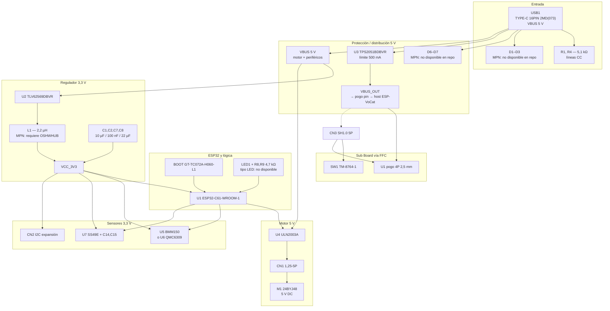

# Auditoría final de hardware — ESP-VoCat Base V1.0

> **Fecha de auditoría:** 2026-07-08  
> **Alcance:** contrastar esquemáticos PDF (`hardware/`), exportación OSHWHUB (`docs/7726, 2155.txt`), página web OSHWHUB, firmware (`software/`) y documentación de fabricación (`docs/es/`).  
> **Regla:** no se han inventado MPN ni valores no presentes en las fuentes.

[← BOM](BOM.md) · [Lista de compra](lista-compra.md) · [Guía de ensamblaje](guia-ensamblaje.md) · [Hardware](hardware.md)

---

## 1. Fuentes consultadas

| Fuente | Contenido útil | Limitaciones |
|--------|----------------|--------------|
| `hardware/SCH_*MainBoard*.pdf` | Valores R/C/L, referencias IC, huellas conectoras | PDF no exporta MPN de diodos, LED ni inductor |
| `hardware/SCH_*SubBoard*.pdf` | TM-8764-1, R1/R2, pogo, CN1 | Sin MPN pogo pin |
| `docs/7726, 2155.txt` | BOM parcial (5 líneas pasivos), montaje, mecánica | Exportación web incompleta; BOM truncada |
| [OSHWHUB esp-echoear-base](https://oshwhub.com/esp-college/esp-echoear-base) (web, 2026-07-08) | Montaje, GPIO, espesor PCB, pogo orientación | Pestaña **BOM: «暂无BOM»** (sin BOM publicada) |
| `3D_models/*.stp` | Geometría 5 piezas | Sin material, orientación, relleno |
| `software/` | GPIO, homing 95°, perfil sensores | No sustituye BOM de componentes |

---

## 2. Diagrama de alimentación

**Ramas de tensión confirmadas:**

| Rail | Origen | Consumidores principales |
|------|--------|-------------------------|
| **VBUS 5 V** | USB Type-C | TLV62569 (entrada), ULN2003A/motor, TPS2051B (entrada), expansión VBUS |
| **VCC_3V3** | TLV62569 + L1 2,2 µH | ESP32-C61, BMM150/QMC6309, SS49E, lógica |
| **VBUS_OUT** | TPS2051B (≤500 mA) | Host ESP-VoCat vía pogo pin |

---

## 3. Verificación R/C — esquemático vs BOM vs lista de compra

### 3.1 Condensadores (Main Board)

| Designadores | Valor (esquemático) | BOM.md | lista-compra.md | OSHWHUB | Estado |
|--------------|---------------------|--------|-----------------|---------|--------|
| C1, C3, C8 | 10 µF | 10 µF ×3, C0603, CL10A106K | 3 × 10 µF | ID 1, CL10A106K | **Coincide** |
| C2, C4, C5, C6, C10–C14 | 100 nF | 100 nF ×9 | ~~10~~ → **9** × 100 nF (corregido) | ID 2, CL05B104K ×9 | **Coincide** (error previo en lista-compra: decía 10) |
| C9 | 1 µF | 1 µF | 1 × 1 µF | ID 3, CL05A105K | **Coincide** |
| C7 | 22 µF | 22 µF | 1 × 22 µF | No en export. parcial | **Valor coincide**; huella/MPN: no disponible |
| C15 | 10 nF | 10 nF | 1 × 10 nF | No en export. parcial | **Valor coincide**; huella/MPN: no disponible |

### 3.2 Resistencias (Main Board)

| Designadores | Valor (esquemático) | BOM.md | lista-compra.md | OSHWHUB | Estado |
|--------------|---------------------|--------|-----------------|---------|--------|
| R1, R4 | 5,1 kΩ | 5,1 kΩ ×2 | 2 × 5,1 kΩ | No en export. | **Coincide** |
| R2 | 100 kΩ | 100 kΩ | 1 × 100 kΩ | No en export. | **Coincide** |
| R3, R6 | 10 kΩ | 10 kΩ ×2 | (incl. en 4×10 kΩ) | ID 4 parcial | **Coincide** |
| R5 | 22,1 kΩ | 22,1 kΩ | 1 × 22,1 kΩ | No en export. | **Coincide** |
| R7 | 1 kΩ | 1 kΩ | 1 × 1 kΩ | No en export. | **Coincide** |
| R8, R9 | 4,7 kΩ | 4,7 kΩ ×2 | 2 × 4,7 kΩ | ID 5 parcial | **Coincide** |
| R10, R11 | 10 kΩ | 10 kΩ ×2 | (incl. en 4×10 kΩ) | ID 4 parcial | **Coincide** |

### 3.3 Resistencias (Sub Board)

| Designadores | Valor | BOM / lista-compra | Esquemático | Estado |
|--------------|-------|-------------------|-------------|--------|
| R1 | 51 kΩ | 51 kΩ | 51 kΩ | **Coincide** |
| R2 | 100 kΩ | 100 kΩ | 100 kΩ | **Coincide** |

### 3.4 Inductor

| Designador | Valor esquemático | BOM | lista-compra | MPN |
|------------|-------------------|-----|--------------|-----|
| L1 | 2,2 µH | Confirmado | Pendiente | **Requiere consultar OSHWHUB** (proyecto clonado en EasyEDA) |

---

## 4. Búsqueda de MPN faltantes

### 4.1 Resultado por componente

| Ref. | Tipo | Dato en esquemático PDF | Dato en OSHWHUB repo/web | MPN identificado | Conclusión |
|------|------|-------------------------|--------------------------|------------------|------------|
| **D1–D3** | Diodos USB | Designadores junto a USB_DP/DN | Sin mención | — | **No disponible en el repositorio.** Requiere clonar proyecto EasyEDA en OSHWHUB |
| **D4–D5** | Diodos Boot | Designadores en circuito BOOT | Sin mención | — | **No disponible en el repositorio** |
| **D6–D7** | Diodos VBUS | Designadores en rama VBUS | Sin mención | — | **No disponible en el repositorio** |
| **LED1** | LED | Designador + R8/R9 4,7 kΩ | Sin mención | — | **No disponible en el repositorio** (color, encapsulado, corriente) |
| **L1** | Inductor | **2,2 µH** | Sin mención | — | Valor confirmado; **MPN y encapsulado: requiere OSHWHUB** |
| **USB1** | USB Type-C | Huella `TYPE-C 16PIN 2MD(073)` | Sin MPN | — | **Referencia de biblioteca EasyEDA**, no MPN LCSC en repo |
| **CN1** | Motor | `1.25-5P WT` | Sin MPN | — | **Referencia de huella**; requiere OSHWHUB |
| **CN2** | I2C | `HC-1.25-4PLT` | Sin MPN | — | **Referencia de huella** |
| **CN3 / CN1 Sub** | FFC | `WAFER-SHB1.0-5PLT-W1-P` | Cable SH1.0 5P 60 mm | — | Especificación mecánica confirmada; **MPN conector: requiere OSHWHUB** |
| **CN4** | RGB | `HC-1.25-3PLT` | Sin MPN | — | **Referencia de huella** |
| **H1** | LD2402 | `PZ254V-11-05P` | LD2402 listado | — | Header genérico 2,54 mm 5P; **MPN exacto: requiere OSHWHUB** |
| **U1 Sub** | Pogo pin | 4P 2,5 mm (silk) | «conector macho 4 pines 2,5 mm con oreja» | — | Especificación mecánica confirmada; **MPN: requiere OSHWHUB** |
| **SW1** | Fin de carrera | **TM-8764-1** | Sin MPN adicional | TM-8764-1 | **Referencia de componente EasyEDA** confirmada en esquemático; MPN fabricante/LCSC no verificado en repo |
| **BOOT** | Táctil | **GT-TC072A-H060-L1** | Sin MPN | GT-TC072A-H060-L1 | **Confirmado** (texto en esquemático) |
| **Rodamiento** | Mecánico | — | 7×11×3 mm | — | Dimensiones confirmadas; **MPN: requiere OSHWHUB** |

### 4.2 Estado de la BOM en OSHWHUB (verificación web 2026-07-08)

La página del proyecto muestra **«暂无BOM»** (sin BOM) en la pestaña BOM, aunque la exportación local `docs/7726, 2155.txt` conserva **5 entradas parciales** de pasivos (C y R). La BOM completa **no está accesible** sin clonar el proyecto en el editor EasyEDA de LCSC/JLCPCB.

---

## 5. Componentes confirmados

Componentes con valor, función y referencia suficiente para fabricar o sustituir con baja incertidumbre:

| Categoría | Componentes |
|-----------|-------------|
| **MCU** | ESP32-C61-WROOM-1-N8R2 |
| **IC potencia** | TLV62569DBVR, TPS2051BDBVR, ULN2003A, AO3400A |
| **Sensores** | BMM150 **o** QMC6309 (uno), SS49E |
| **Pasivos Main** | Todos los valores R1–R11; C1–C15 (valores) |
| **Pasivos Sub** | R1 51 kΩ, R2 100 kΩ |
| **Electromecánico** | BOOT GT-TC072A-H060-L1, SW1 TM-8764-1 (ref. esquemático) |
| **Motor** | 24BYJ48 DC 5V |
| **Mecánica** | Rodamiento 7×11×3 mm; tornillería M4/M2; imanes D10×1,5 y D6×5 |
| **Cable** | FFC SH1.0 5P 60 mm, doble extremo misma dirección |
| **PCB** | MainBoard + SubBoard V1.0, espesor **1,0 mm** |
| **3D** | 5 archivos STEP en `3D_models/` |
| **GPIO (firmware)** | Motor 25–28, I2C 2–3, Hall ADC 5, límite **GPIO1**, UART 8/29, Boot 9 |

---

## 6. Componentes pendientes

| Componente | Qué falta | Dónde obtenerlo |
|------------|-----------|-----------------|
| D1–D7 | Tipo, encapsulado, MPN | Clonar proyecto OSHWHUB → BOM EasyEDA |
| LED1 | Color, encapsulado, MPN | Idem |
| L1 | Encapsulado, corriente nominal, MPN | Idem |
| USB1, CN1–CN4, H1 | MPN LCSC/JLC | Idem |
| Pogo pin U1 Sub | MPN comercial | Idem o grupo técnico OSHWHUB |
| C7, C15 | Huella SMD exacta | Idem |
| R1,R4,R2,R5,R7 (Main) | Huella si distinta de 0402 | Idem |
| Sub Board R1,R2 | Huella | Idem |
| Rodamiento | MPN (ej. 687ZZ) | Idem / medida confirmada |
| **Gerber PCB** | Archivos de fabricación | Clonar y exportar desde OSHWHUB |
| **Parámetros impresión 3D** | Material, orientación, soportes, capa, relleno | No publicados; OSHWHUB / prueba en slicer |

---

## 7. Componentes con incertidumbre

| Tema | Detalle | Fuente en conflicto | Resolución recomendada |
|------|---------|---------------------|------------------------|
| **Cantidad imanes D10×1,5 mm** | Montaje OSHWHUB: **2 uds.**; lista compra OSHWHUB: **1 ud.** | `7726, 2155.txt` pasos 1 vs lista materiales | Comprar **2** (coherente con montaje) |
| **Modelo motor** | Esquemático/OSHWHUB: **24BYJ48**; algunos README: **28BYJ-48** | `README_ES.md`, `tablas-referencia.md`, README firmware | Usar **24BYJ48** (esquemático + OSHWHUB + `hardware.md`) |
| **Ángulo homing** | Firmware: **95°**; OSHWHUB uso: **90°** en un apartado | `esp_vocat_rotating_base_main.c` vs web OSHWHUB | Seguir **firmware (95°)** para réplica software |
| **GPIO fin de carrera** | Firmware/OSHWHUB: **GPIO1**; `guia-ensamblaje.md` decía GPIO8 (error) | Esquemático muestra GPIO8 como UART RX | **GPIO1** = límite; **GPIO8** = UART RX (corregido en guía) |
| **BMM150 disponibilidad** | Comentario OSHWHUB: descatalogado/falsificaciones | Foro OSHWHUB | Considerar **QMC6309** + perfil `qmc6309` |
| **Huellas conectoras** | Nombres EasyEDA ≠ MPN único | Esquemático | Verificar en BOM clonada antes de pedir SMT |
| **BOM OSHWHUB web** | Export local parcial vs web vacía | Página actual | Tratar export local como snapshot; confirmar en clon |

---

## 8. Componentes reemplazables

| Componente | ¿Obligatorio Espressif? | Sustituto documentado |
|------------|-------------------------|----------------------|
| ESP32-C61-WROOM-1 | **Sí** | ESP32-C61-WROOM-1U (variante antena) |
| BMM150 | No | QMC6309 (excluyente en PCB) |
| QMC6309 | No | BMM150 |
| SS49E | No | Otros Hall lineales (recalibrar ADC) |
| TLV62569DBVR | No | Buck 3,3 V pin-compatible (verificar) |
| TPS2051BDBVR | No | Power switch USB similar |
| ULN2003A | No | Clones ULN2003 / TD62783 |
| AO3400A | No | MOSFET N SOT-23 equivalente |
| GT-TC072A-H060-L1 | No | Tact switch 6×6 mm |
| TM-8764-1 | No | Micro switch activo bajo similar |
| 24BYJ48 | No | Cualquier 24BYJ48 5V estándar |
| Pasivos R/C | No | Valores estándar 0402/0603 |
| LD2402, WS2812B | No (opcional) | Omitir si no se usan |

---

## 9. Riesgos para fabricar una réplica

| Riesgo | Severidad | Mitigación |
|--------|-----------|------------|
| **Sin Gerber en repo** | Alta | Clonar proyecto en OSHWHUB; pedir PCB+SMT en JLCPCB |
| **BOM incompleta (diodos, LED, L1)** | Alta | Exportar BOM desde EasyEDA tras clonar; no adivinar tipos |
| **WLCSP BMM150/QMC6309** | Alta | Usar servicio SMT; OSHWHUB lo advierte |
| **FFC invertido / cortocircuito** | Alta | Verificar dirección antes de insertar (paso 9 montaje) |
| **Orientación pogo pin** | Media | Extremo rojo = lado círculo blanco en PCB Sub |
| **Polaridad imanes** | Media | Probar atracción D6×5 ↔ D10×1,5 antes de cerrar carcasa |
| **BMM150 obsoleto/falso** | Media | Preferir QMC6309 según comunidad OSHWHUB |
| **Parámetros 3D no documentados** | Baja | Iterar en slicer; piezas estructurales en PLA/PETG |
| **Motor 28BYJ vs 24BYJ** | Media | Usar solo **24BYJ48** |
| **Documentación GPIO errónea** | Baja | Usar `tablas-referencia.md` y firmware como referencia |

---

## 10. Contradicciones detectadas y estado

| # | Contradicción | Estado en documentación |
|---|---------------|----------------------|
| 1 | Imanes D10×1,5: 1 vs 2 unidades | Documentado en `lista-compra.md`; recomendación: **2** |
| 2 | Motor 24BYJ48 vs 28BYJ-48 | **Corregido** en `README_ES.md`, `tablas-referencia.md`, `arquitectura.md` (README firmware EN aún dice 28BYJ-48) |
| 3 | Homing 90° vs 95° | Firmware = 95°; anotar en ensamblaje |
| 4 | GPIO8 vs GPIO1 (fin de carrera) | **Corregido** en `guia-ensamblaje.md` |
| 5 | Condensadores 100 nF: cantidad 10 vs 9 | **Corregido** en `lista-compra.md` |
| 6 | BOM OSHWHUB web vacía vs export parcial | Documentado en esta auditoría |

---

## 11. Checklist previa a fabricación

### PCB

- [ ] Clonar proyecto [OSHWHUB esp-echoear-base](https://oshwhub.com/esp-college/esp-echoear-base)
- [ ] Exportar Gerber MainBoard + SubBoard V1.0
- [ ] Confirmar espesor **1,0 mm** en ambas placas
- [ ] Exportar BOM completa y posición de componentes (CPL) para SMT
- [ ] Revisar que solo se coloca **U5 o U6**, no ambos

### Componentes

- [ ] ESP32-C61-WROOM-1-N8R2 (×1)
- [ ] TLV62569DBVR, TPS2051BDBVR, ULN2003A, AO3400A (×1 c/u)
- [ ] BMM150 **o** QMC6309 (×1) + SS49E (×1)
- [ ] Pasivos según tablas §3 (valores verificados)
- [ ] D1–D7, LED1, L1: **pedir solo tras obtener MPN de OSHWHUB**
- [ ] BOOT GT-TC072A-H060-L1, SW1 TM-8764-1
- [ ] Conectores según huellas esquemático (MPN desde BOM clonada)
- [ ] Pogo pin 4P 2,5 mm con oreja
- [ ] Opcional: LD2402, WS2812B

### Impresión 3D

- [ ] Descargar 5 STEP de `3D_models/`
- [ ] Mapear piezas según tabla OSHWHUB (ver `guia-ensamblaje.md`)
- [ ] Definir material y orientación en slicer (**no documentado en repo**)
- [ ] Verificar tolerancias de asiento motor y rodamiento

### Tornillería

- [ ] M4×5 mm (×2)
- [ ] M2×4 mm (×2)
- [ ] M2×3 mm (×2)

### Imanes

- [ ] D10×1,5 mm (×**2** recomendado)
- [ ] D6×5 mm (×1)
- [ ] Verificar polaridad antes del cierre

### Cableado

- [ ] Cable motor 24BYJ48 → CN1 (1,25 mm 5P)
- [ ] FFC SH1.0 5P 60 mm, **misma dirección** en ambos extremos
- [ ] Motor: conector **en ángulo** (silk «Motor»)
- [ ] Sub Board: conector **recto** en Main

### Calibración (post-montaje)

- [ ] Flashear firmware con `MAG_SW_PROFILE` correcto
- [ ] Homing: giro hasta fin de carrera (GPIO1) + **95°**
- [ ] Calibración magnética (3 posiciones o perfil ss49e)
- [ ] UART 115200 con host ESP-VoCat
- [ ] Comprobar límite 500 mA en VBUS_OUT si alimenta host

---

## 12. Informe de reproducibilidad

Metodología: **52 líneas de aprovisionamiento** contabilizadas (ICs, pasivos por valor, diodos, LED, inductor, conectores, PCBs, motor, mecánica, 3D, cableado).

| Métrica | % | Descripción |
|---------|---|-------------|
| **Diseño eléctrico documentado** | **~85%** | Valores R/C/L, ICs principales, arquitectura, GPIO, montaje |
| **MPN exactos en repo** | **~42%** | 22/52 líneas con MPN o referencia de pedido directo (ICs, BOOT, parte de pasivos OSHWHUB, motor, ESP32) |
| **Réplica solo con este repositorio** | **~38%** | Sin Gerber, sin MPN diodos/LED/L1/conectores, sin BOM web completa |
| **Réplica con repo + clon OSHWHUB** | **~78%** | Añade Gerber, BOM EasyEDA, MPN conectores y pasivos restantes (estimado) |
| **Réplica mecánica completa** | **~70%** | STEP disponibles; faltan parámetros de impresión oficiales |

### Elementos que **siempre** dependen de fuentes externas

1. **Gerber / pedido PCB** — clonar [OSHWHUB](https://oshwhub.com/esp-college/esp-echoear-base)
2. **BOM completa actualizada** — editor EasyEDA (pestaña BOM web vacía al 2026-07-08)
3. **MPN D1–D7, LED1, L1** — solo en proyecto EasyEDA clonado
4. **Parámetros slicer 3D** — no publicados en STEP ni OSHWHUB
5. **Host ESP-VoCat** — producto separado para prueba UART/magnética completa

### Conclusión

Con **únicamente este repositorio**, un fabricante puede entender el diseño, comprar la mayoría de semiconductores y pasivos por valor, imprimir mecánica e ensamblar siguiendo `guia-ensamblaje.md`, pero **no puede** pedir PCB ni completar SMT sin clonar OSHWHUB, ni identificar con certeza diodos, LED e inductor.

Con **repositorio + proyecto OSHWHUB clonado**, la reproducibilidad sube al **~78%**, quedando pendientes sobre todo parámetros de impresión 3D y validación mecánica fina.

---

*Auditoría elaborada sin inventar referencias. Los MPN parciales `0402WGF1` / `0402WGF4` en la exportación OSHWHUB están truncados y corresponden probablemente a `0402WGF1002` y `0402WGF4700` (UniOhm), pero no se han asignado como confirmados al no aparecer completos en ninguna fuente del repo.*
