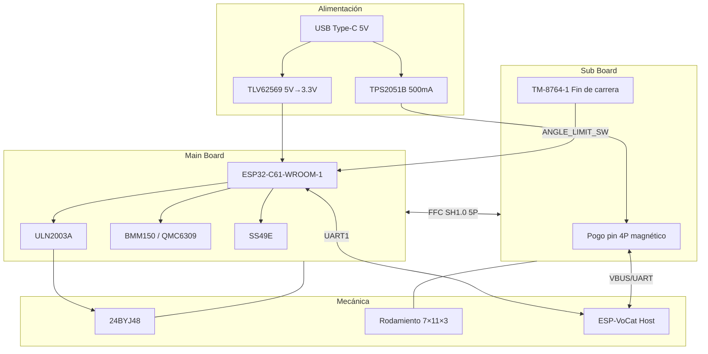
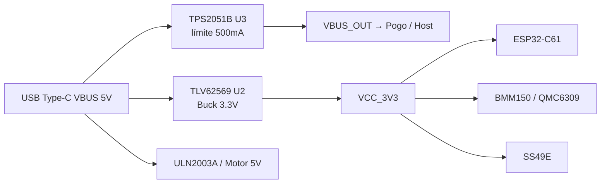
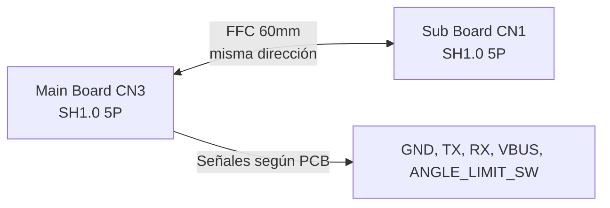
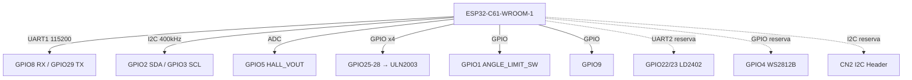
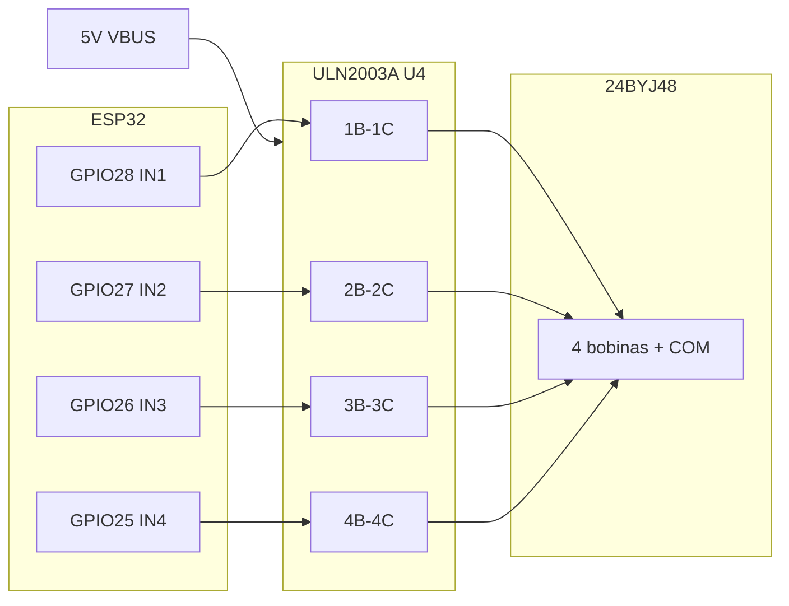
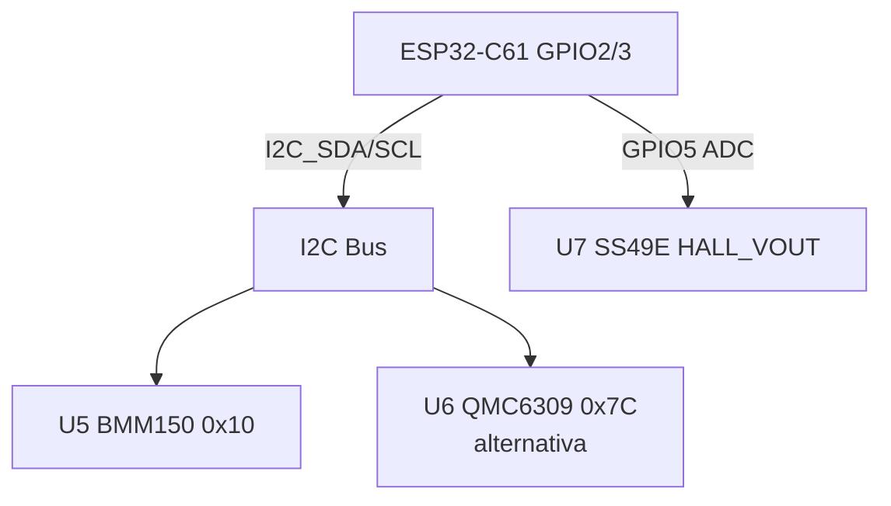
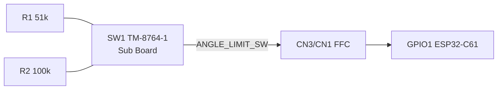
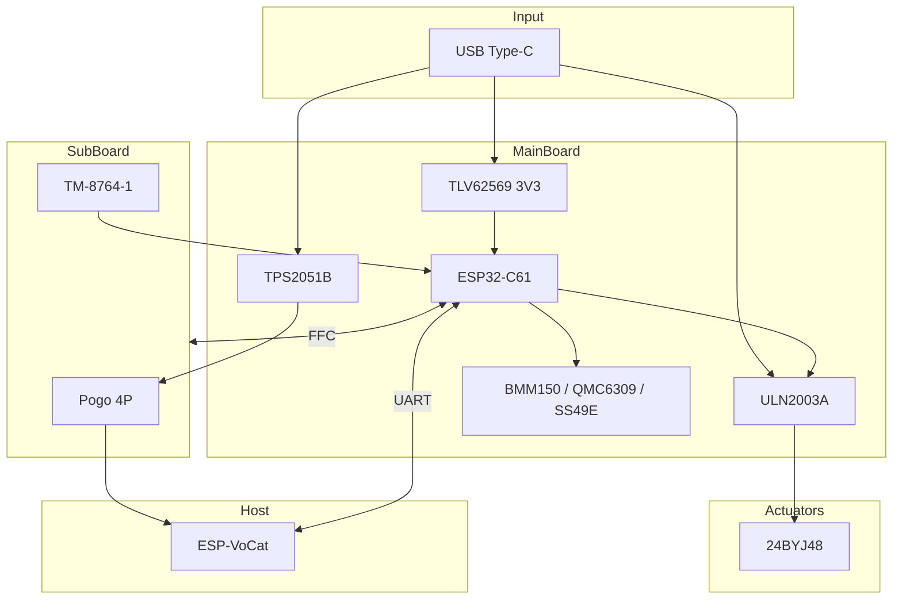

# Documentación de hardware — ESP-VoCat Base V1.0

> **Fuentes utilizadas en este análisis (sin suposiciones externas):**
> - `hardware/SCH_SCH-ESP-VoCat-Base-MainBoard-V1_0_2026-03-11.pdf`
> - `hardware/SCH_SCH-ESP-VoCat-Base-SubBoard-V1_0_2026-03-11.pdf`
> - `hardware/PCB_PCB-ESP-VoCat-Base-MainBoard-V1_0_2026-03-11.pdf`
> - `hardware/PCB_PCB-ESP-VoCat-Base-SubBoard-V1_0_2026-03-11.pdf`
> - `3D_models/` (archivos STEP/STP)
> - Código fuente: `stepper_motor.h`, `control_serial.h`, `magnetic_slide_switch.h`, `esp_vocat_rotating_base_main.c`
> - `docs/7726, 2155.txt` (exportación parcial de [OSHWHUB esp-echoear-base](https://oshwhub.com/esp-college/esp-echoear-base))
>
> **No disponible en el repositorio:** archivos Gerber, proyectos KiCad/Altium/EasyEDA editables, BOM completa exportable. Solo existen PDF de esquemático y PCB.

[← Guía central](../../README_ES.md) · [Tablas GPIO/firmware](tablas-referencia.md)

---

## 1. Descripción general

El hardware ESP-VoCat Base V1.0 (2026-03-11) es una base rotatoria compuesta por **dos PCB**:

| Placa | Archivo esquemático | Función principal |
|-------|---------------------|-------------------|
| **Main Board** | `SCH-ESP-VoCat-Base-MainBoard-V1_0` | MCU, alimentación, motor, sensores, UART al host, expansiones |
| **Sub Board** | `SCH-ESP-VoCat-Base-SubBoard-V1_0` | Acoplamiento magnético al ESP-VoCat, fin de carrera de homing |

Ambas placas se montan sobre la mecánica impresa en 3D (`3D_models/`) con un motor **24BYJ48**, rodamiento **7×11×3 mm** y conectores magnéticos pogo pin.

---

## 2. Main Board — función y bloques

Según el diagrama de bloques del esquemático (página 1):

| Bloque | Componente | Función |
|--------|------------|---------|
| Entrada USB | `USB1` TYPE-C 16PIN | Alimentación 5 V y USB para depuración/expansión |
| Limitación de corriente | `U3` TPS2051BDBVR | Limita corriente a **500 mA** en salida `VBUS_OUT` hacia el host |
| Regulador DC-DC | `U2` TLV62569DBVR | Convierte 5 V → **3,3 V** (`VCC_3V3`) |
| MCU | `U1` ESP32-C61-WROOM-1 | Control, UART, I2C, ADC, FreeRTOS |
| Driver motor | `U4` ULN2003A | Excita bobinas del 24BYJ48 |
| Magnetómetro (opción A) | `U5` BMM150 | I2C — detección magnética (predeterminado en firmware) |
| Magnetómetro (opción B) | `U6` QMC6309 | I2C — alternativa; **soldar solo uno** |
| Hall lineal | `U7` SS49E | Salida analógica → ADC |
| LED RGB (expansión) | `CN4` + `Q1` AO3400A | Interfaz WS2812B con conversión de nivel |
| Radar presencia (expansión) | `H1` + LD2402 | UART2 — interfaz reservada |
| I2C expansión | `CN2` HC-1.25-4PLT | Bus I2C externo |
| Botón Boot | `BOOT` GT-TC072A-H060-L1 | GPIO9 — recalibración magnética |
| LED indicador | `LED1` | Con `R8`, `R9` 4,7 kΩ |
| Conector motor | `CN1` 1.25-5P WT | Cable plano al 24BYJ48 |
| Conector Sub Board | `CN3` WAFER-SHB1.0-5PLT-W1-P | FFC 1,0 mm 5 pines |

---

## 3. Sub Board — función

Según esquemático y documentación OSHWHUB (`docs/7726, 2155.txt`):

| Función | Implementación |
|---------|----------------|
| Acoplamiento magnético al ESP-VoCat | `U1` — conector pogo pin macho **4 pines, 2,5 mm con oreja** (TXD, RXD, VBUS, GND) |
| Fin de carrera de homing | `SW1` TM-8764-1 → señal `ANGLE_LIMIT_SW` |
| Conexión a Main Board | `CN1` WAFER-SHB1.0-5PLT-W1-P (mismo tipo que `CN3` de Main Board) |
| Red divisora del interruptor | `R1` 51 kΩ, `R2` 100 kΩ |

La Sub Board se monta en el **rodamiento** del plato giratorio. El fin de carrera detecta el límite mecánico para la calibración angular del motor.

> **Orientación crítica (OSHWHUB):** al soldar el conector magnético en Sub Board, el extremo marcado en rojo debe coincidir con el círculo blanco de la PCB.

---

## 4. Alimentación

| Rail | Origen | Consumidores (según esquemático) |
|------|--------|----------------------------------|
| **VBUS** (5 V) | USB Type-C | Entrada DC-DC, ULN2003/motor, TPS2051B |
| **VCC_3V3** | TLV62569DBVR (`U2`) + `L1` 2,2 µH | ESP32-C61, BMM150, QMC6309, SS49E, lógica |
| **VBUS_OUT** | TPS2051BDBVR (`U3`) | Alimentación del ESP-VoCat vía pogo pin (máx. 500 mA) |

**Protección / condicionamiento de alimentación:**
- `TPS2051BDBVR`: limitación de corriente documentada a 500 mA para alimentación del host.
- Condensadores de desacoplo en VBUS y VCC_3V3 (`C1`–`C9`, `C5`, `C6`, `C7` 22 µF, etc.).
- Diodos `D1`–`D7` en rutas USB (protección según esquemático).
- Resistencias `R1`, `R4` 5,1 kΩ en líneas CC del USB Type-C.

**Requisito documentado (OSHWHUB / firmware):** alimentación mínima recomendada **5 V / 1 A** para operación del motor.

---

## 5. Interconexión entre placas

| Señal (etiqueta PCB) | Origen | Destino | Función |
|----------------------|--------|---------|---------|
| `GND` | Común | Común | Referencia |
| `TX1` / `TXD` | Main GPIO29 | Sub → Pogo → Host | UART TX base |
| `RX1` / `RXD` | Main GPIO8 | Sub → Pogo → Host | UART RX base |
| `VBUS` | Main (tras TPS2051B) | Sub → Pogo | Alimentación host |
| `ANGLE_LIMIT_SW` | Sub `SW1` | Main GPIO1 | Fin de carrera (activo bajo) |

**Cable especificado (OSHWHUB):** terminal SH **1,0 mm**, **5 pines**, **60 mm**, ambos extremos en la **misma dirección**. Verificar orientación antes de insertar para evitar cortocircuitos.

**Conexión motor (Main Board):**
- `CN1` (1.25-5P WT) — conector en ángulo recto marcado **«Motor»**.
- Señales: `STEPPER_MOTOR_IN1`–`IN4` → ULN2003 → bobinas 24BYJ48.

---

## 6. ESP32-C61 — asignación de pines

### 6.1 Pines utilizados por el firmware (confirmado en código)

| GPIO | Etiqueta esquemático | Función | Módulo firmware | Interfaz |
|------|---------------------|---------|-----------------|----------|
| **GPIO 1** | `ANGLE_LIMIT_SW` | Fin de carrera homing | `esp_vocat_rotating_base_main.c` | Entrada digital, activo bajo |
| **GPIO 2** | `I2C_SDA` / `GPIO2` | Datos I2C sensor | `magnetic_slide_switch.h` | I2C0 SDA |
| **GPIO 3** | `I2C_SCL` / `GPIO3` | Reloj I2C sensor | `magnetic_slide_switch.h` | I2C0 SCL |
| **GPIO 5** | `HALL_VOUT` / `GPIO5` | Salida analógica Hall | `magnetic_slide_switch.h` | ADC_CHANNEL_3 |
| **GPIO 8** | `RX1` / `GPIO8` | UART RX | `control_serial.h` | UART1 RX |
| **GPIO 9** | `GPIO9` / `BOOT` | Botón Boot | `esp_vocat_rotating_base_main.c` | Entrada, activo bajo |
| **GPIO 25** | `STEPPER_MOTOR_IN4` | Motor IN4 | `stepper_motor.h` | Salida digital |
| **GPIO 26** | `STEPPER_MOTOR_IN3` | Motor IN3 | `stepper_motor.h` | Salida digital |
| **GPIO 27** | `STEPPER_MOTOR_IN2` | Motor IN2 | `stepper_motor.h` | Salida digital |
| **GPIO 28** | `STEPPER_MOTOR_IN1` | Motor IN1 | `stepper_motor.h` | Salida digital |
| **GPIO 29** | `TX1` / `GPIO29` | UART TX | `control_serial.h` | UART1 TX |

### 6.2 Pines asignados en hardware pero no usados por el firmware base actual

| GPIO | Etiqueta esquemático | Hardware conectado | Notas |
|------|---------------------|-------------------|-------|
| **GPIO 4** | `RGB_CTRL` | `CN4` WS2812B vía `Q1` AO3400A | Expansión LED RGB — sin driver en firmware analizado |
| **GPIO 7** | `LD2402_IO` | Header `H1` pin IO | Radar LD2402 — sin driver en firmware analizado |
| **GPIO 12** | `GPIO12` | Rutas USB D+/D- (esquemático) | No referenciado en firmware |
| **GPIO 13** | `GPIO13` | Rutas USB D+/D- (esquemático) | No referenciado en firmware |
| **GPIO 22** | `LD2402_RX` | Header `H1` | UART2 expansión LD2402 |
| **GPIO 23** | `LD2402_TX` | Header `H1` | UART2 expansión LD2402 |

### 6.3 Pines listados en esquemático sin asignación clara en firmware

| GPIO | Estado |
|------|--------|
| GPIO 0 | Circuito `ESP_EN` / reset (no usado como IO en firmware) |
| GPIO 6 | Aparece en lista de pines del módulo; **sin conexión funcional identificada en esquemático extraído** |
| GPIO 24 | Aparece en pinout del módulo; **sin uso en firmware ni etiqueta de red clara** |

> Para confirmar GPIO 6 y GPIO 24, consultar el netlist completo en el proyecto EasyEDA original en [OSHWHUB](https://oshwhub.com/esp-college/esp-echoear-base) (no incluido en este repositorio).

### 6.4 Diagrama de interfaces del MCU

---

## 7. Circuito del motor paso a paso

### 7.1 Componentes

| Ref. | Componente | Encapsulado / tipo | Función |
|------|------------|-------------------|---------|
| — | 24BYJ48 | Motor paso a paso 5 V | Actuador mecánico (externo a PCB) |
| `U4` | ULN2003A | DIP/SOP Darlington array | Driver de corriente para bobinas |
| `CN1` | 1.25-5P WT | Conector wafer | Interfaz cable motor |
| `C10` | 100 nF | — | Desacoplo en rama motor/VBUS |

### 7.2 Conexión eléctrica (esquemático → firmware)

| Señal PCB | GPIO ESP32 | Entrada ULN2003 | Firmware |
|-----------|------------|-----------------|----------|
| `STEPPER_MOTOR_IN1` | GPIO 28 | 1B | `IN1_PIN` |
| `STEPPER_MOTOR_IN2` | GPIO 27 | 2B | `IN2_PIN` |
| `STEPPER_MOTOR_IN3` | GPIO 26 | 3B | `IN3_PIN` |
| `STEPPER_MOTOR_IN4` | GPIO 25 | 4B | `IN4_PIN` |

### 7.3 Secuencia de control (firmware)

El firmware usa **half-step de 8 pasos** (`stepper_motor.c`):
- Secuencias `step_sequence_cw[8][4]` y `step_sequence_ccw[8][4]`.
- Aceleración/desaceleración: `STEPPER_ACCEL_STEPS = 30`, `STEPPER_DECEL_STEPS = 30`.
- Tras cada movimiento: `stepper_motor_power_off()` desenergiza bobinas.

**Alimentación del motor:** 5 V (`VBUS`) a través del ULN2003A, coherente con 24BYJ48 DC 5V documentado en OSHWHUB.

---

## 8. Circuito del sensor magnético

### 8.1 BMM150 (`U5`) — opción predeterminada

| Parámetro | Valor | Fuente |
|-----------|-------|--------|
| Interfaz | I2C | Esquemático + firmware |
| Dirección I2C | `0x10` | `magnetic_slide_switch.h` |
| Chip ID | `0x32` | `magnetic_slide_switch.h` |
| Pines I2C | SDA=GPIO2, SCL=GPIO3 | Esquemático + firmware |
| Alimentación | VCC_3V3 | Esquemático |
| Desacoplo | `C11`, `C12` 100 nF | Esquemático |
| Encapsulado | WLCSP (OSHWHUB) | Documentación OSHWHUB |

### 8.2 QMC6309 (`U6`) — alternativa

| Parámetro | Valor | Fuente |
|-----------|-------|--------|
| Dirección I2C | `0x7C` | `magnetic_slide_switch.h` |
| Chip ID | `0x90` | `magnetic_slide_switch.h` |
| Desacoplo | `C13` 100 nF | Esquemático |
| Selección | **Solo uno** BMM150 o QMC6309 soldado | OSHWHUB + `Kconfig` |

> Ambos comparten el bus I2C (`I2C_SCL`, `I2C_SDA`). Son pads alternativos en la misma PCB.

### 8.3 SS49E (`U7`) — sensor Hall lineal

| Parámetro | Valor | Fuente |
|-----------|-------|--------|
| Tipo | Hall lineal, salida analógica | Esquemático |
| Señal | `HALL_VOUT` → GPIO5 | Esquemático + firmware |
| ADC | `ADC_CHANNEL_3` | `magnetic_slide_switch.h` |
| Desacoplo / filtro | `C14` 100 nF, `C15` 10 nF | Esquemático |
| Alimentación | VCC_3V3 | Esquemático |
| Limitación firmware | Solo eventos SLIDE_UP / SLIDE_DOWN | `Kconfig` + README |

### 8.4 Pull-ups I2C

El esquemático extraído **no lista resistencias pull-up I2C dedicadas** con designador visible en la página 2. Los pull-ups pueden estar:
- Integrados en el módulo ESP32-C61, o
- En otra hoja/no extraídos correctamente del PDF.

> **Dato no confirmado en PDF extraído:** valor de pull-ups I2C. Verificar en proyecto EasyEDA en OSHWHUB.

---

## 9. Sistema de calibración — fin de carrera

### 9.1 Hardware

| Ref. | Componente | Tipo | Ubicación |
|------|------------|------|-----------|
| `SW1` | TM-8764-1 | Interruptor de límite (fin de carrera) | Sub Board |
| `R1` | 51 kΩ | Divisor / pull | Sub Board |
| `R2` | 100 kΩ | Divisor / pull | Sub Board |
| Señal | `ANGLE_LIMIT_SW` | Hacia Main Board GPIO1 | FFC 5P |

### 9.2 Conexión eléctrica

### 9.3 Lógica de firmware

Fuente: `esp_vocat_rotating_base_main.c`

| Parámetro | Valor |
|-----------|-------|
| Pin | `GPIO_NUM_1` |
| Nivel activo | Bajo (`active_level = 0`) |
| Detección | Componente `iot_button` → semáforo binario |
| Secuencia homing | Girar -5° en bucle hasta pulsar fin de carrera |
| Tras activación | Esperar 200 ms → girar +95° → `stepper_motor_power_off()` |
| Timeout | 2000 ms → modo fallback (+95° sin fin de carrera) |

---

## 10. Lista de materiales (BOM)

> **Guía de fabricación completa:** [BOM.md](BOM.md) (tabla detallada con MPN y alternativas) · [lista-compra.md](lista-compra.md) · [guia-ensamblaje.md](guia-ensamblaje.md)

### 10.1 Main Board — componentes activos (esquemático PDF)

| Ref. | Componente | Valor / modelo | Encapsulado | Función |
|------|------------|----------------|-------------|---------|
| `U1` | ESP32-C61-WROOM-1 | — | Módulo Wi-Fi | MCU principal |
| `U2` | TLV62569DBVR | Buck DC-DC | SOT-23-6 | 5 V → 3,3 V |
| `U3` | TPS2051BDBVR | Límite 500 mA | SOT-23-5 | Switch VBUS hacia host |
| `U4` | ULN2003A | Darlington array | — | Driver motor paso a paso |
| `U5` | BMM150 | Magnetómetro 3 ejes | WLCSP | Sensor magnético I2C (opción A) |
| `U6` | QMC6309 | Magnetómetro 3 ejes | WLCSP | Sensor magnético I2C (opción B) |
| `U7` | SS49E | Hall lineal | — | Sensor Hall analógico |
| `Q1` | AO3400A | MOSFET N | — | Control WS2812B / nivel |
| `USB1` | TYPE-C 16PIN 2MD(073) | USB Type-C | — | Entrada alimentación |
| `L1` | Inductor | 2,2 µH | — | DC-DC |
| `BOOT` | GT-TC072A-H060-L1 | Táctil | — | Botón Boot |
| `LED1` | LED | — | — | Indicador |
| `D1`–`D7` | Diodos | — | — | Protección USB / señales |
| `CN1` | 1.25-5P WT | 5 pines 1,25 mm | Wafer | Conector motor |
| `CN3` | WAFER-SHB1.0-5PLT-W1-P | 5 pines 1,0 mm | — | Cable a Sub Board |
| `CN2` | HC-1.25-4PLT | 4 pines 1,25 mm | — | Expansión I2C |
| `CN4` | HC-1.25-3PLT | 3 pines 1,25 mm | — | Expansión WS2812B |
| `H1` | PZ254V-11-05P | Header 5 pines | — | Interfaz LD2402 |

### 10.2 Main Board — pasivos (esquemático PDF)

| Ref. | Valor | Función inferida del esquemático |
|------|-------|----------------------------------|
| `C1`, `C8` | 10 µF | Desacoplo DC-DC / bulk 3V3 |
| `C3` | 10 µF | Desacoplo |
| `C7` | 22 µF | Entrada/salida DC-DC |
| `C9` | 1 µF | Desacoplo |
| `C2`, `C4`, `C5`, `C6`, `C10`–`C15` | 100 nF / 10 nF (`C15`) | Desacoplo por IC/ruta |
| `R1`, `R4` | 5,1 kΩ | USB Type-C CC |
| `R2` | 100 kΩ | Retroalimentación DC-DC |
| `R5` | 22,1 kΩ | Retroalimentación DC-DC |
| `R3`, `R6` | 10 kΩ | Circuito EN / GPIO9 |
| `R7` | 1 kΩ | — |
| `R8`, `R9` | 4,7 kΩ | LED |
| `R10`, `R11` | 10 kΩ | Polarización `Q1` |

### 10.3 Sub Board (esquemático PDF)

| Ref. | Componente | Valor | Función |
|------|------------|-------|---------|
| `CN1` | WAFER-SHB1.0-5PLT-W1-P | 5P 1,0 mm | Conexión a Main Board |
| `SW1` | TM-8764-1 | — | Fin de carrera |
| `U1` | Conector pogo pin magnético | 4P 2,5 mm | Acoplamiento ESP-VoCat |
| `R1` | 51 kΩ | — | Red del interruptor |
| `R2` | 100 kΩ | — | Red del interruptor |

### 10.4 BOM parcial OSHWHUB (archivo `docs/7726, 2155.txt`)

La exportación web de OSHWHUB en el repositorio está **incompleta** (solo algunos pasivos):

| ID | Valor | Designadores | Huella | Cant. | Fab |
|----|-------|--------------|--------|-------|-----|
| 1 | 10 µF | C3, C1, C8 | C0603 | 3 | CL10A106K |
| 2 | 100 nF | C4,C2,C10,C11,C12,C13,C14,C5,C6 | C0402 | 9 | CL05B104K |
| 3 | 1 µF | C9 | C0402 | 1 | CL05A105K |
| 4 | 10 kΩ | R3, R6, R10, R11 | R0402 | 4 | 0402WGF1 |
| 5 | 4,7 kΩ | R8, R9 | R0402 | 2 | 0402WGF4 |

> **BOM completa:** descargar desde [OSHWHUB — esp-echoear-base](https://oshwhub.com/esp-college/esp-echoear-base). No está incluida como archivo estructurado en este repositorio.

### 10.5 Componentes mecánicos y externos (OSHWHUB + `docs/7726, 2155.txt`)

| # | Componente | Especificación |
|---|------------|----------------|
| 1 | Motor paso a paso | 24BYJ48 DC 5V |
| 2 | Rodamiento | ID 7 mm, OD 11 mm, H 3 mm |
| 3 | Imán deslizador | D6×5 mm (1 ud.) |
| 4 | Imán acoplamiento | D10×1,5 mm (2 ud. en carcasa) |
| 5 | Cable FFC | SH 1,0 mm 5P, 60 mm, misma dirección |
| 6 | Tornillos | M4×5, M2×4, M2×3 |
| 7 | Radar (opcional) | LD2402 |
| 8 | Conector magnético | Pogo pin macho 4P 2,5 mm con oreja |

**Espesor PCB recomendado (OSHWHUB):** 1,0 mm.

---

## 11. Modelos 3D (`3D_models/`)

| Archivo | Origen CAD | Función inferida (nombre + OSHWHUB) |
|---------|------------|-------------------------------------|
| `ESP-VoCat catbase cover 2025-11-22.STEP` | SolidWorks 2017 | Carcasa exterior superior |
| `ESP-VoCat catbase platform top 2025-11-22.STEP` | SolidWorks 2017 | Cubierta superior del plato giratorio |
| `ESP-VoCat catbase ball only 2025-11-22.STEP` | SolidWorks 2017 | Componente esférico / detalle mecánico |
| `ESP-VoCat_catbase_20251128.stp` | — | Conjunto o carcasa principal (versión 2025-11-28) |
| `ESP-VoCat_catbase_platform_btm_20251128.stp` | — | Cubierta inferior del plato giratorio (versión 2025-11-28) |

### Relación mecánica ↔ electrónica (OSHWHUB, `docs/7726, 2155.txt`)

| Pieza 3D / mecánica | Componente electrónico |
|---------------------|------------------------|
| Carcasa exterior | Aloja Main Board, motor, rodamiento |
| Plato giratorio (top + bottom) | Monta Sub Board y rodamiento 7×11×3 |
| Ranura en carcasa | Rodamiento |
| Alojamiento motor | 24BYJ48 fijado con tornillos M4×5 |
| Interruptor deslizante 3D + imán D6×5 | Interacción con BMM150/QMC6309 en Main Board |
| Imanes D10×1,5 en carcasa | Acoplamiento magnético con ESP-VoCat |
| Sub Board en plato giratorio | Pogo pin hacia host + fin de carrera |

### Secuencia de montaje (OSHWHUB)

1. Ensamblar imanes D10×1,5 en carcasa (atención a polaridad).
2. Instalar rodamiento 7×11×3 en ranura 3D.
3. Instalar motor 24BYJ48 (M4×5, apretar tras montar plato).
4. Instalar Sub Board en cubierta inferior del plato.
5. Instalar cubierta superior del plato (M2×3).
6. Insertar cable SH1.0 5P en interfaz del plato.
7. Montar plato en eje del motor; apretar tornillos motor.
8. Fijar Main Board a carcasa (M2×4).
9. Conectar cable motor (CN1, ángulo recto «Motor») y FFC Sub Board (CN3).
10. Instalar imán D6×5 en deslizador magnético 3D; calibrar al encender.

---

## 12. Archivos de diseño disponibles y ausentes

| Tipo | Disponible en repo | Archivos |
|------|-------------------|----------|
| Esquemático PDF | Sí | `hardware/SCH_*MainBoard*.pdf`, `SCH_*SubBoard*.pdf` |
| PCB PDF | Sí | `hardware/PCB_*MainBoard*.pdf`, `PCB_*SubBoard*.pdf` |
| Gerber | **No** | Debería estar en OSHWHUB al pedir fabricación |
| KiCad / Altium / EasyEDA editable | **No** | Proyecto fuente en [OSHWHUB](https://oshwhub.com/esp-college/esp-echoear-base) |
| BOM CSV/Excel completa | **No** | Parcial en `docs/7726, 2155.txt`; completa en OSHWHUB |
| Modelos 3D | Sí | `3D_models/*.STEP`, `*.stp` |

---

## 13. Diagramas eléctricos adicionales

### 13.1 Arquitectura eléctrica completa

### 13.2 Flujo de alimentación

Ver sección 4.

### 13.3 Conexión del sensor magnético

Ver sección 8.

### 13.4 Conexión del interruptor Home

Ver sección 9.

---

## 14. Fabricación de réplica — checklist mínimo

Basado exclusivamente en documentación del repositorio:

- [ ] Pedir PCB Main Board + Sub Board (OSHWHUB/JLCPCB, espesor **1,0 mm**)
- [ ] Soldar componentes SMT (considerar WLCSP de BMM150/QMC6309)
- [ ] Soldar **solo uno**: BMM150 **o** QMC6309
- [ ] Imprimir piezas 3D desde `3D_models/`
- [ ] Adquirir motor 24BYJ48, rodamiento 7×11×3, imanes, cable SH1.0 5P
- [ ] Ensamblar según secuencia OSHWHUB (sección 11)
- [ ] Flashear firmware: `idf.py set-target esp32c61 && idf.py flash`
- [ ] Configurar sensor en `menuconfig` coherente con hardware soldado
- [ ] Ejecutar calibración magnética (3 posiciones, ~500 ms cada una)

---

## 15. Referencias cruzadas

| Tema | Documento |
|------|-----------|
| GPIO y UART en firmware | [tablas-referencia.md](tablas-referencia.md) |
| Arranque y homing | [arranque-firmware.md](arranque-firmware.md) |
| Arquitectura software | [arquitectura.md](arquitectura.md) |
| Problemas de hardware | [troubleshooting.md](troubleshooting.md) |
| Proyecto OSHWHUB | https://oshwhub.com/esp-college/esp-echoear-base |

---

*Documento generado a partir de extracción de texto de PDFs en `hardware/`, metadatos STEP, firmware y exportación OSHWHUB presente en el repositorio. Versión hardware: V1.0 (2026-03-11).*
