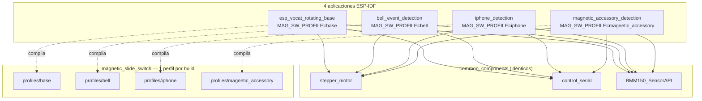
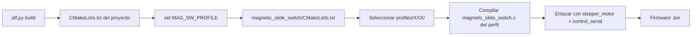

# Arquitectura basada en perfiles (Profiles)

> Derivado de: `software/common_components/magnetic_slide_switch/CMakeLists.txt`, carpetas `profiles/`, `CMakeLists.txt` de cada aplicación.

[← Volver a la guía principal](../../README_ES.md) · [Tablas de referencia](tablas-referencia.md)

---

## Concepto

El componente `magnetic_slide_switch` implementa la detección magnética como un **módulo único** cuyo comportamiento se especializa mediante **perfiles** (`profiles`). Cada perfil proporciona:

1. Un archivo de implementación propio: `profiles/<perfil>/magnetic_slide_switch.c`
2. Un header con enums de eventos, umbrales y API: `profiles/<perfil>/include/magnetic_slide_switch.h`

La selección del perfil ocurre en **tiempo de compilación** mediante la variable CMake `MAG_SW_PROFILE`, definida en el `CMakeLists.txt` de cada aplicación.

```cmake
# software/esp_vocat_rotating_base/CMakeLists.txt
set(MAG_SW_PROFILE "base")

# software/esp_vocat_rotating_base_bell_event_detection/CMakeLists.txt
set(MAG_SW_PROFILE "bell")
```

El `CMakeLists.txt` del componente resuelve la ruta:

```cmake
if(MAG_SW_PROFILE STREQUAL "base")
    set(MAG_SW_PROFILE_DIR "profiles/base")
elseif(MAG_SW_PROFILE STREQUAL "bell")
    set(MAG_SW_PROFILE_DIR "profiles/bell")
# ... iphone, magnetic_accessory
endif()

idf_component_register(
    SRCS "${MAG_SW_PROFILE_DIR}/magnetic_slide_switch.c"
    INCLUDE_DIRS "${MAG_SW_PROFILE_DIR}/include"
    ...
)
```

---

## Diagrama: reutilización de componentes



**Los cuatro proyectos comparten exactamente el mismo código** de motor, UART y driver BMM150. **Solo cambia** el archivo `magnetic_slide_switch.c` y su header según el perfil seleccionado.

---

## Diferencias entre perfiles

| Aspecto | `base` | `bell` | `iphone` | `magnetic_accessory` |
|---------|--------|--------|----------|----------------------|
| Eventos de deslizador (1–7) | Sí | Sí | No | No |
| Pez / emparejamiento | Sí (en deslizador) | No | No | Sí (por eje Z) |
| Helado / dona | No | No | No | Sí |
| Detección iPhone | No | No | Sí (eventos 16–19) | No |
| API de callback | No | Sí | Sí | Sí |
| Envío UART de eventos | Directo en `.c` | Vía callback en `app_main` | Vía callback | Vía callback |
| Umbrales específicos | `FISH_FROM_UP_*`, `MAG_PAIRING_*` | Sin pez/emparejamiento | `MAGNETIC_ACCESSORY_DETECTION_Z_*` | `FISH_ATTACHED_Z_*`, `ICE_CREAM_*`, `DONUT_*` |

---

## Flujo de compilación por perfil



No es necesario cambiar de rama Git: basta con abrir el directorio del proyecto deseado y compilar.

---

## Diferencia en `app_main` entre perfiles

### Perfil `base`

```c
// esp_vocat_rotating_base_main.c — sin callback
control_serial_init();
control_serial_start_magnetic_detect_task();
xTaskCreate(base_calibration_task, ...);
magnetic_slide_switch_start();
// Los eventos se envían dentro de magnetic_slide_switch.c
```

### Perfiles `bell`, `iphone`, `magnetic_accessory`

```c
// Antes de magnetic_slide_switch_start():
magnetic_slide_switch_register_callback(magnetic_slide_switch_event_cb);

static void magnetic_slide_switch_event_cb(magnetic_slide_switch_event_t event) {
    control_serial_send_magnetic_switch_event((uint16_t)event);
}
```

Esta separación permite que los perfiles demo deleguen el reporte UART a la capa de aplicación, facilitando la personalización sin modificar `control_serial`.

---

## Configuración de sensor (independiente del perfil)

El tipo de sensor se selecciona en `menuconfig` (`Kconfig` del componente), no por perfil:

| Opción | Efecto |
|--------|--------|
| `CONFIG_SENSOR_BMM150` | Magnetómetro Bosch, I2C 0x10 |
| `CONFIG_SENSOR_QMC6309` | Magnetómetro QST, I2C 0x7C |
| `CONFIG_SENSOR_LINEAR_HALL` | ADC GPIO 5; solo SLIDE_UP/DOWN |

Cada perfil adapta sus umbrales por sensor mediante `#ifdef CONFIG_SENSOR_BMM150` en su header.

---

## Enum de eventos: referencia única por perfil

La fuente de verdad para los códigos de evento UART es el `typedef enum` en el header del perfil activo:

- `profiles/base/include/magnetic_slide_switch.h` → eventos 1–11
- `profiles/bell/include/magnetic_slide_switch.h` → eventos 1–7
- `profiles/iphone/include/magnetic_slide_switch.h` → eventos 16–19
- `profiles/magnetic_accessory/include/magnetic_slide_switch.h` → eventos 8–15

> Los valores numéricos se envían tal cual en el campo DATA de la trama UART (`control_serial_send_magnetic_switch_event`).

---

## Ventajas del diseño por perfiles

1. **Sin duplicación de motor ni UART:** un solo `stepper_motor.c` y `control_serial.c`.
2. **Compilación independiente:** cada demo es un proyecto ESP-IDF completo.
3. **Umbrales aislados:** cambiar detección de iPhone no afecta al firmware base.
4. **Extensibilidad:** nuevo perfil = nueva carpeta en `profiles/` + nuevo proyecto o cambio de `MAG_SW_PROFILE`.

Ver [Cómo extender el proyecto](extender-proyecto.md) para instrucciones de creación de un perfil nuevo.
